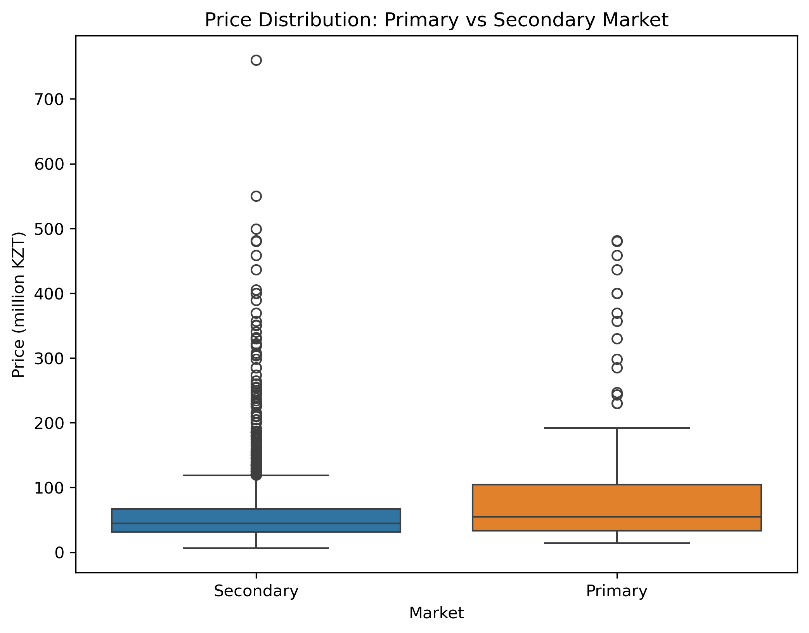
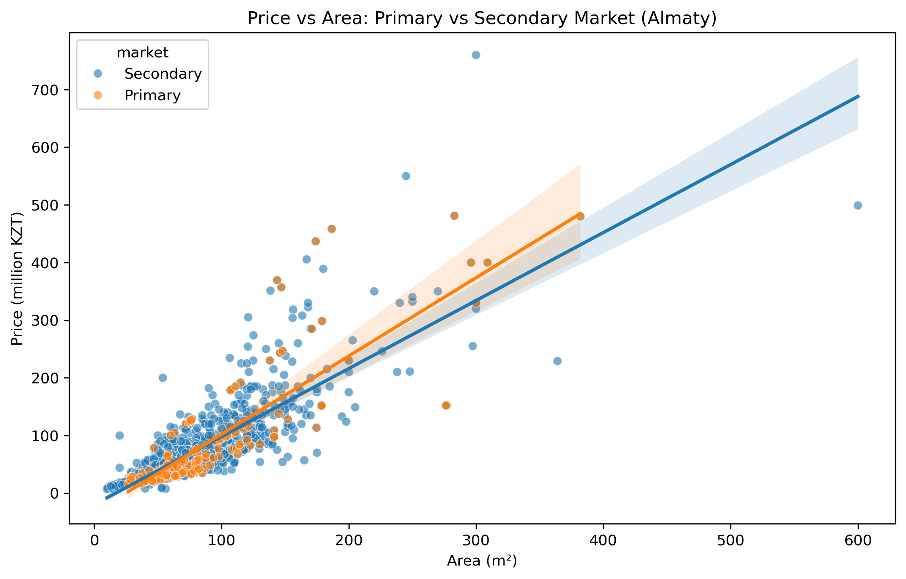
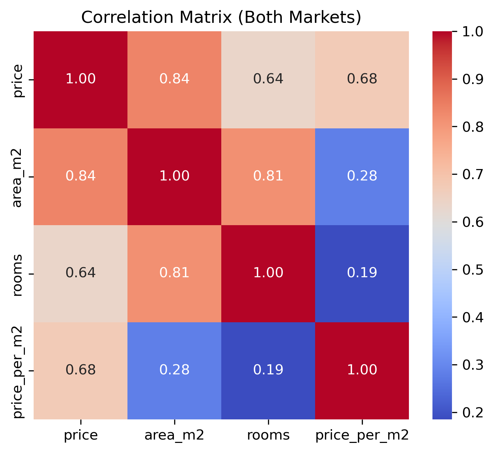

# Almaty Real Estate & Auto Market Analysis
### Primary vs Secondary Market — Data Collection, Cleaning & Visualization

> **Team project** | SDU University, Data Visualization Course  
> **Team:** Aliya Yskak, Aida Amangeldi, Elyar Zainudinov

---

## Overview

This project analyzes the **primary and secondary real estate and automobile markets in Almaty, Kazakhstan** using real-world data scraped from two major online marketplaces:

- 🏠 **Krisha.kz** — apartment listings (primary & secondary market)
- 🚗 **Kolesa.kz** — car listings (primary & secondary market)

The goal was to compare pricing patterns, identify market trends, and visualize key differences between market segments through interactive dashboards and exploratory analysis.

---

## Project Structure

```
├── krisha_parsed.ipynb              # Web scraper for Krisha.kz (real estate)
├── kolesa_parser.ipynb              # Web scraper for Kolesa.kz (automobiles)
├── visualizations_krisha.ipynb      # EDA & visualizations for real estate data
├── visualizations_kolesa.ipynb      # EDA & visualizations for auto market data
├── krisha_primary_almaty_FIXED.csv  # Cleaned primary real estate data
├── krisha_secondary_almaty_FIXED.csv
├── krisha_combined_almaty.csv       # Combined dataset
├── kolesa_primary_almaty_FIXED.csv  # Cleaned primary auto market data
├── kolesa_secondary_almaty_FIXED.csv
├── boxplot_price_distribution.png   # Price distribution visualization
├── scatter_price_area.png           # Price vs area scatter plot
└── correlation_heatmap.png          # Feature correlation heatmap
```

---

## Tech Stack

| Tool | Purpose |
|------|---------|
| Python | Core language |
| BeautifulSoup + Requests | Web scraping |
| Pandas | Data cleaning & manipulation |
| Matplotlib / Seaborn | Visualizations |
| Power BI | Interactive dashboards |

---

## Key Steps

### 1. Data Collection
- Scraped 1000+ listings from Krisha.kz and Kolesa.kz using `requests` + `BeautifulSoup`
- Extracted: price, area (m²), number of rooms, district, condition, listing type

### 2. Data Cleaning
- Handled missing values, duplicates, and inconsistent formatting
- Parsed structured fields (rooms, area, district) from raw text using regex
- Calculated derived features: `price_per_m2`, district normalization

### 3. Analysis & Visualization
- **Price distribution** by market type (boxplots)
- **Price vs Area** scatter analysis
- **Correlation heatmap** of key numeric features
- **District-level** price comparison across Almaty neighborhoods
- **Primary vs Secondary** market segmentation

---

## Sample Visualizations

| Price Distribution | Price vs Area | Correlation Heatmap |
|:-:|:-:|:-:|
|  |  |  |

---

## Key Findings

- Secondary market listings show wider price variance compared to primary market
- Price per m² varies significantly across Almaty districts (Medeu vs Ауэзовский)
- Vehicle age is the strongest predictor of price in the auto market
- Primary real estate market skews toward higher price brackets with less room-count variety

---

## How to Run

```bash
# Clone the repo
git clone https://github.com/YOUR_USERNAME/almaty-market-analysis.git
cd almaty-market-analysis

# Install dependencies
pip install requests beautifulsoup4 pandas matplotlib seaborn

# Run notebooks in order:
# 1. krisha_parsed.ipynb      → scrape & clean real estate data
# 2. kolesa_parser.ipynb      → scrape & clean auto data
# 3. visualizations_krisha.ipynb
# 4. visualizations_kolesa.ipynb
```

> **Note:** Web scraping results may vary depending on site structure updates. Pre-cleaned CSV files are included so you can skip straight to analysis.

---

## Authors

- **Aida Amangeldi** — [@kaamangeldi22](https://linkedin.com/in/kaamangeldi22/)
- Aliya Yskak
- Elyar Zainudinov
